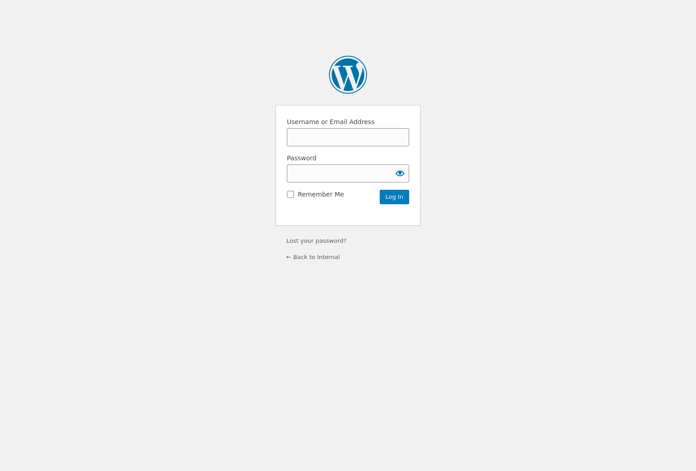
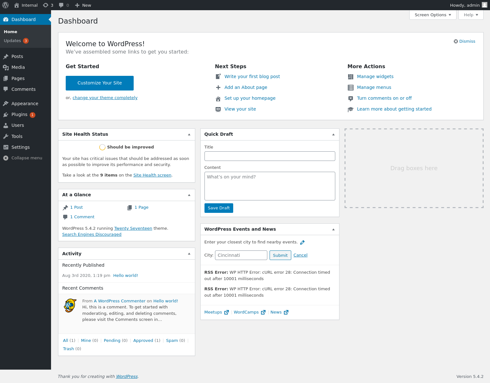
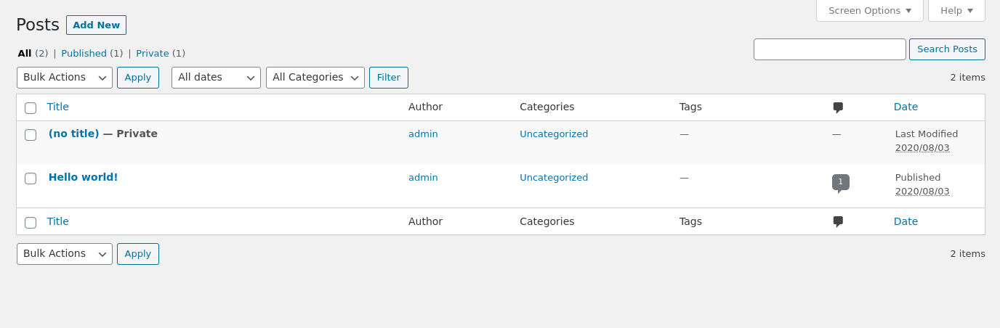
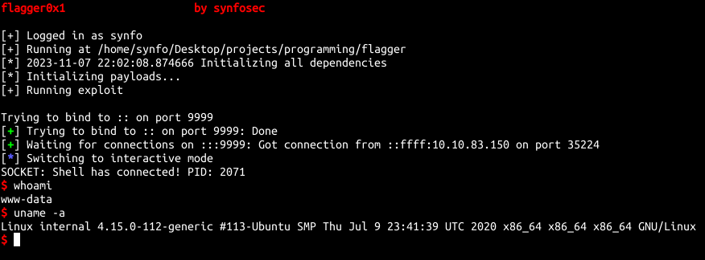
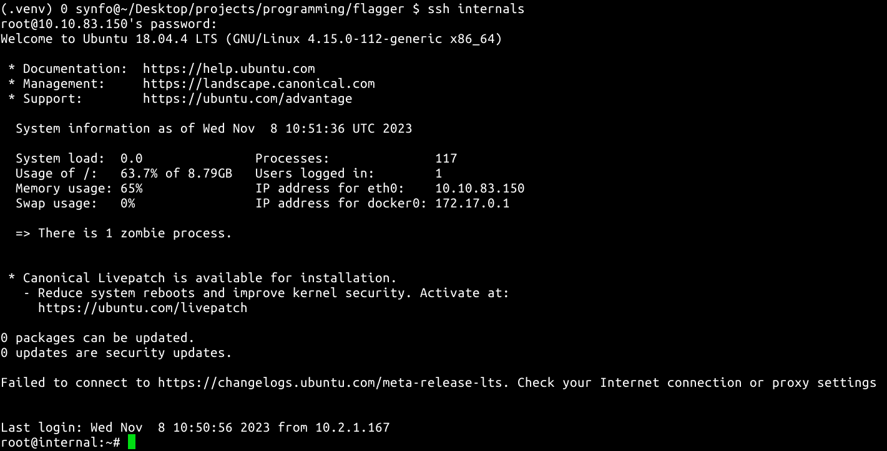

# Internal

#### Information Given

You have been assigned to a client that wants a penetration test conducted on an environment due to be released to production in three weeks. 

**Scope of Work**

The client requests that an engineer conducts an external, web app, and internal assessment of the provided virtual environment. The client has asked that minimal information be provided about the assessment, wanting the engagement conducted from the eyes of a malicious actor (black box penetration test).  The client has asked that you secure two flags (no location provided) as proof of exploitation:

- ```User.txt```
- ```Root.txt```

Additionally, the client has provided the following scope allowances:

- Ensure that you modify your hosts file to reflect internal.thm
- Any tools or techniques are permitted in this engagement
- Locate and note all vulnerabilities found
- Submit the flags discovered to the dashboard
- Only the IP address assigned to your machine is in scope

**(Roleplay off)**

I encourage you to approach this challenge as an **actual penetration test**. Consider writing a report, to include an executive summary, vulnerability and exploitation assessment, and remediation suggestions, as this will benefit you in preparation for the eLearnsecurity eCPPT or career as a penetration tester in the field.

Note - this room can be completed without Metasploit

## Step 1

Since this is a black box pentest, run a network scan

```
Discovered open port 80/tcp on 10.10.134.228                                   
Discovered open port 22/tcp on 10.10.134.228
```

Both SSH and HTTP is open

## Step 2

The root page is just an Apache2 page


But if we spider the directories we get a ```/blog/wp-login.php```



## Step 3

When you enter a non-valid username in the username field you get a message stating there is no user. When you enter admin it says the password is wrong so we know admin is a user on the page

## Step 4

There are no BF protections in place so we can start runnning a brute at ```/blog/wp-login.php```

## Step 5

After brute force you get a dashboard page at ```/blog/wp-admin/```



## Step 6

I spent some time walking down the application. I found that there's this private post and there's a theme editor section



The private post had some credentials on there and the theme editor allows PHP code

## Step 7

Utilizing the editor section we can start crafting malware in PHP. Use whatever but since we are trying to compromise, the code should be shell oriented

## Step 8

Put your code in the editor section of the main ```index.php``` which should be ```/blog```


## Exploit

Run your listener and reload ```/blog```



Shell popped

## Step 10

Now we need to find the flag

```
find / -type f -iname "*.txt" 2>/dev/null
```

After the command we see ```wp-save.txt```. In that file we get more credentials potentially giving us lateral movement in the system

## Step 11

I tried using **william**'s credentials we got earlier for SSH but that didn't work so I tried **aubreanna**'s and was successful

In the cwd we got

- ```user.txt```
- ```jenkins.txt```

User.txt was the first flag and jenkins.txt contained

```
Internal Jenkins service is running on 172.17.0.2:8080
```

This may be an opportunity for vertical movement

## Step 12

The internal service we are trying to access can only be interacted from within our compromised system. Knowing this, we can reverse the ssh connection to our local machine so that we can see the web page in our browser

## Step 13

We end up on a Jenkins login page

I walked this service as I am not familiar with Jenkins, I attempted SQLi payloads to check weaknesses in that area, there is nothing really useful in the sorce code or outgoing requests so I decided to try brute again with the username as **admin**

## Exploit

We now have access to the Jenkins dashboard which provides a script console. It shows what seems to be Java code (Determined by the error codes).

I don't know Java so I pulled revshell code from google, pasted it in there and started my listener again

## Step 15

We are now user **jenkins**

I checked for any sort of user permission vulnerability. I didn't get anywhere so I tried looking for a .txt file again

```
find / -type f -iname "*.txt" 2>/dev/null
```

Wasn't expecting it but there actually was another .txt file in the **/opt** directory named **note.txt** that revealed the password for root

## Step 16

Using the creds, we log into root



and in the **/root** directory there was the last flag
